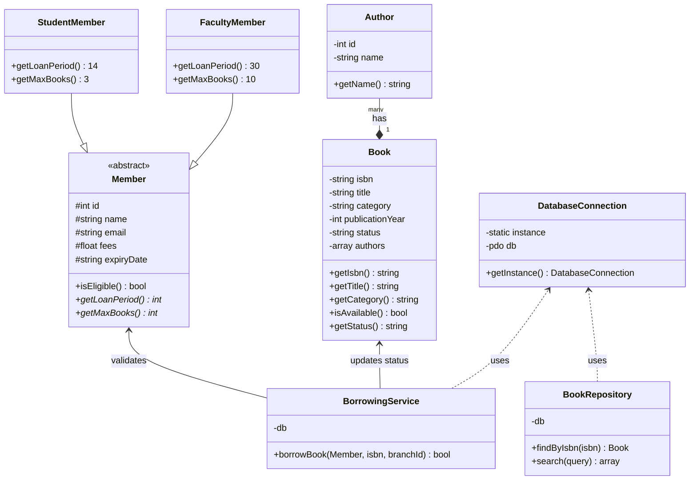

# Technical Diagrams

## Class Diagram

This diagram represents the Object-Oriented structure of the Library System, including the implementation of Inheritance, Polymorphism, and the Service Layer.

